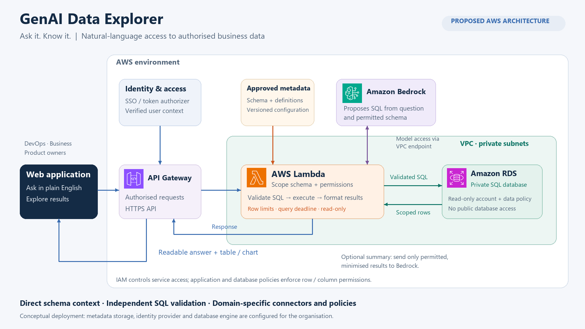

# GenAI Data Explorer architecture

Proposed AWS architecture for natural-language database access.

- [Static diagram (PNG)](genai-data-explorer-architecture.png)
- [Editable vector diagram (SVG)](genai-data-explorer-architecture.svg)
- [Animated request flow (GIF)](genai-data-explorer-architecture-animated.gif)

API Gateway forwards authorised requests to Lambda. Lambda supplies approved schema context to Bedrock, validates the returned SQL for syntax and permitted access, executes it with read-only database permissions, and returns the answer. Validation and execution belong to the same Lambda layer; no separate backend validation service is required.

The diagram describes the proposed enterprise deployment. Model-generated SQL is independently validated, and application/database policies enforce data access. IAM service permissions do not themselves filter records or fields. Kendra is not part of this architecture.

[Official AWS icon attribution](ICON_SOURCES.md)

## Additional SQL agent diagram

[SQL agent architecture (PNG)](sql-agent.png) — supplied diagram showing ConverseSQLAgent Lambda, Amazon Bedrock, RDS, DynamoDB, Secrets Manager, and VPC endpoints.

